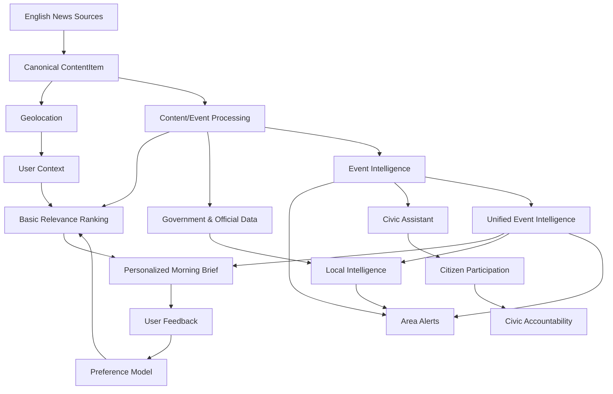

\# SAHAY — Roadmap

\> Phased engineering plan, dependencies, and open questions. Priorities here reflect \*\*build order\*\*, not end-user feature priority — see \`vision.md\` for the product-facing pillars.

\>

\> Revised after a feasibility review of each phase's real-world data dependencies. Phases with external-API risk are marked: ✅ feasible as written · ⚠️ feasible with a narrower scope than originally written · ❌ not feasible as a self-serve API, needs a workaround.

\---

\## User Deliverable Roadmap

The roadmap is organized around **what users receive in each release**. Each user-facing phase contains the technical implementation phases required to deliver it.

The principle is: **every release must provide meaningful user value**, while technical work remains an implementation detail underneath the user deliverable.

## R1 — Personalized Morning Brief

**User value:** Users wake up to a concise briefing created specifically for them.

### User Deliverables

- Registration via Mobile OTP, Google, and Apple.
- User profile: current location, hometown, age/age group, occupation, gender, interests, and language preference.
- English-only personalized morning brief.
- Personalized updates from current location, hometown, India, and selected interests.
- Source transparency with original article/source and published time.
- 👍 / 👎 feedback on every item.

### Technical Implementation

- English news ingestion from an initial reliable source.
- Multi-source English news ingestion.
- Canonical `ContentItem` model.
- Geo-location and location association.
- Authentication and user profile storage.
- Basic relevance/ranking engine using location, interests, profile, recency, importance, and confidence.
- Feedback collection and persistent user preference signals.
- Morning brief generation.
- Basic article deduplication.

**Cost principle:** Avoid per-user/per-story LLM calls. Shared AI processing happens at ingestion/event level; personalization is primarily deterministic.

## R2 — Personalized Feed

**User value:** SAHAY continuously improves what each user sees based on their behavior.

### Technical Implementation

- Feedback-based preference model.
- Topic/category preference scoring.
- Source preference scoring.
- Location preference scoring.
- Positive/negative interaction weighting.
- Recency decay.
- Improved relevance ranking.
- Personalized feed API and UI.

## R3 — Local Intelligence

**User value:** Users understand important developments happening around their locations.

### Technical Implementation

- Government and official data sources.
- Municipal announcements.
- IMD weather and warning data.
- Traffic/transport authority updates.
- Civic geography and administrative boundaries.
- Location-aware event extraction.
- Source trust classification.

## R4 — Proactive Area Alerts

**User value:** SAHAY warns users before local events disrupt their day.

### Technical Implementation

- Event intelligence engine.
- Urgency classification.
- Confidence scoring.
- Bounded traffic/corridor monitoring.
- Geographic impact estimation.
- Alert prioritization.
- Notification infrastructure.
- Critical/High/Important/Informational alert levels.

## R5 — Civic Assistant

**User value:** Users can ask SAHAY about civic problems and understand what to do.

### Technical Implementation

- Civic search and retrieval.
- Authority identification.
- Grounded AI responses.
- "Why does this matter?" explanations.
- Recommended actions.
- Voice input.
- Additional Indian language support.

## R6 — Citizen Participation

**User value:** Users can participate in and understand issues affecting their community.

### Technical Implementation

- Citizen issue reporting.
- Polls.
- Community signals.
- Issue categorization.
- Issue moderation.
- Duplicate issue detection.
- Community confirmation/support.

## R7 — Civic Accountability

**User value:** Users can follow a civic issue from reporting through resolution.

### Technical Implementation

- Responsible-authority mapping.
- Issue lifecycle.
- Authority response tracking.
- Status updates.
- Resolution tracking.
- Notifications.
- Official portal integrations where technically and legally feasible.

## R8 — Unified Event Intelligence

**User value:** SAHAY presents one trustworthy picture of a real-world event instead of fragmented information.

### Technical Implementation

- Cross-source event clustering.
- Semantic similarity.
- Cross-language event matching.
- Source corroboration.
- Event timelines.
- Confidence engine.
- Multi-source event representation.
- Deduplication across news, government, traffic, weather, and citizen signals.

## R9 — Full SAHAY Civic Companion

**User value:** Users can discover, understand, decide, act, and track civic matters in one place.

### Technical Implementation

- Advanced reasoning.
- Proactive recommendations.
- Rich neighbourhood intelligence.
- More Indian languages.
- Government service integrations.
- Advanced voice interaction.
- Cross-source event reasoning.
- Advanced civic accountability.

---

## Development Dependency Map

---

## Feasibility Summary (quick reference)

\| Source | Status | Notes |

\| --- | --- | --- |

\| News RSS (\`feedsmith\`) | ✅ Free, reliable | Multiple Delhi outlets in Hindi and English |

\| \`data.gov.in\` (OGD) | ✅ Free, self-serve | Static/periodic datasets, not live announcements |

\| IMD weather + Highway Nowcast Warning | ✅ Free, self-serve | Best cost-to-value source for road/weather alerts |

\| MCD / PWD / DJB announcements | ❌ No public API | Requires per-department scraping/change-detection |

\| Google Routes API (traffic) | ⚠️ Paid, per-query | Works for a bounded corridor list, not city-wide |

\| Google Roads Management Insights | ❌ Not self-serve | Enterprise/public-sector contract only |

\| Reddit API | ❌ Not viable at this stage | Free tier now pre-approval-gated; commercial \~$12k/month |

\| Facebook/Instagram Graph API | ❌ Not viable | No public keyword search since API lockdown |

\| Citizen-submitted reports | ✅ Fully in your control | Best near-term substitute for external social signals |

\| Civic issue *\*submission\** (vs. tracking) | ⚠️ Mostly no submit-API | Guided redirect or fragile automation, not a clean POST |

\---

\## MVP Strategy

### Recommended first user-facing release

**R1 — Personalized Morning Brief**

The first release should already provide meaningful value:

**Registration → Profile → English news ingestion → Personalization → Morning Brief → 👍/👎 feedback**

The brief should use the user's current location, hometown, interests, and profile to determine what matters.

### Cost Strategy

AI should be used primarily during ingestion/event processing:

- Generate article summaries once and reuse them.
- Extract topics, entities, locations, urgency, and other metadata once.
- Do not call an LLM for every user/story recommendation.
- Use deterministic ranking and user feedback for personalization.
- Gradually introduce more sophisticated recommendation models as interaction data grows.

### Product Evolution

**Personalized Brief → Personalized Feed → Local Intelligence → Area Alerts → Civic Assistant → Citizen Participation → Civic Accountability → Unified Civic Intelligence**

## Open Questions for Product & Technical Design

Resolved by this review (kept for traceability):

\- \~\~Which map/traffic provider should be used initially?\~\~ → Google Routes API, scoped to a bounded corridor list; IMD Highway Nowcast Warning as a free complement.

\- \~\~Which social platforms can provide usable APIs/data for the intended use case?\~\~ → None viable at MVP budget; start with citizen-submitted signals instead.

Still open:

\- Which data providers should be used for the first geography beyond the ones identified here?

\- Which specific MCD/PWD/DJB pages are stable enough to scrape reliably, and how should breakage be detected and alerted on?

\- What are the licensing and attribution requirements for each source (especially IMD and \`data.gov.in\`)?

\- How should event confidence be calculated?

\- What threshold is required before an event can trigger a critical notification?

\- How should conflicting sources be handled?

\- Which Indian languages should be supported after Hindi/English, and in what order?

\- What data should be stored for personalization, and for how long?

\- How should inferred user attributes be handled and explained?

\- Which civic integrations should be prioritized for the first launch geography, given most have no submit-API?

\- How should citizen-generated content be moderated?

\- How should duplicate citizen issues be clustered?

\- What is the minimum reliable version of "How does this affect me?" for launch?

\- How should SAHAY measure whether its recommendations are actually more useful than a conventional news feed?

\---

\## Recommended Immediate Next Step

Build the first complete R1 vertical slice:

> **English news source → ingestion → canonical `ContentItem` → storage → user registration/profile → location + hometown → relevance ranking → personalized morning brief → 👍/👎 feedback.**

Start with English only. Add additional English sources once the first source works reliably.

The architecture should make adding a new source feel like **adding an adapter**, not creating a new product subsystem.

