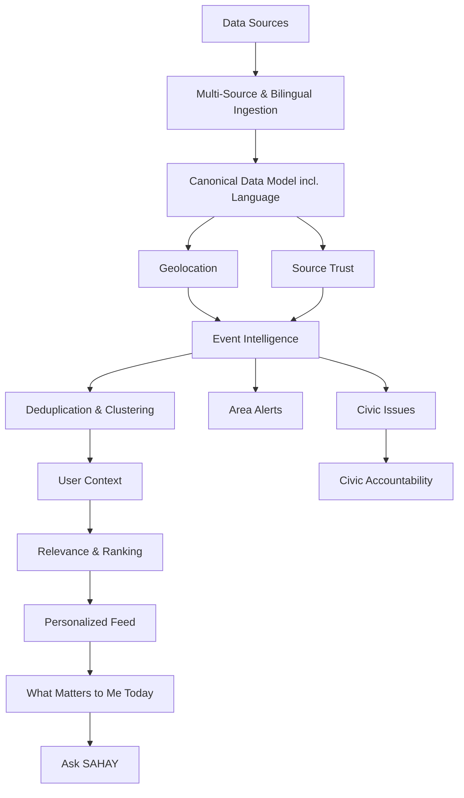

# SAHAY — Roadmap

> Phased engineering plan, dependencies, and open questions. Priorities here reflect **build order**, not end-user feature priority — see `vision.md` for the product-facing pillars.
>
> Revised after a feasibility review of each phase's real-world data dependencies. Phases with external-API risk are marked: ✅ feasible as written · ⚠️ feasible with a narrower scope than originally written · ❌ not feasible as a self-serve API, needs a workaround.

---

## Engineering Development Order

This is the recommended **development order**, which is different from the eventual end-user feature priority.

The principle is **build the data and intelligence foundation bottom-up before building the personalized experience on top of it.**

## Phase 1 — News Ingestion Pipeline ✅

**Goal:** Prove that SAHAY can continuously collect and store external information.

Build:

- One reliable news source first.
- Fetcher / polling mechanism.
- Raw article storage.
- Parsing and normalization.
- Source metadata.
- Basic API to retrieve stored articles.

Do not start with many providers. Prove the pipeline end-to-end with one source first.

## Phase 1B — Multi-Source & Bilingual News Ingestion ✅ *(new)*

**Goal:** Prove the adapter pattern generalizes, and get Hindi/English content into the model before the canonical schema is finalized — not after.

Build:

- 3–5 additional Delhi-relevant news sources via `feedsmith`, mixing English (e.g. Hindustan Times, Indian Express Delhi desk) and Hindi (e.g. Dainik Jagran, Amar Ujala, NDTV Hindi) outlets. Several major Delhi outlets already publish Hindi RSS feeds, so bilingual coverage is close to free at this stage rather than a separate future project. Multi-feed publishers (PIB by ministry/region, a daily’s section RSS) use `SourceFeed` rows under one `Source`.
- Normalization for inconsistent fields across sources: missing `pubDate`, inconsistent category taxonomies, encoding issues in Devanagari text.
- Near-duplicate detection for wire stories (multiple outlets running the same PTI feed).
- Basic language detection per item (`hi` / `en` / mixed), stored as raw metadata for now — this becomes a first-class `ContentItem` field in Phase 2.

Skipping this phase and going straight from one source to the canonical model risks designing that model around assumptions a single feed happens to satisfy. Do this before Phase 2, not after.

## Phase 2 — Canonical Data Model ✅

**Goal:** Make every future source fit one internal model.

Introduce a common `ContentItem` / event-oriented representation containing concepts such as:

- Type.
- Source.
- Publisher.
- URL.
- Title.
- Summary.
- **Language** and **language confidence** — required from this phase, not deferred. Populate from the Phase 1B detection work; this field is what makes cross-language search and bilingual UI possible later without a schema migration.
- Published/fetched timestamps.
- Location.
- Category.
- Entities.
- Urgency.
- Confidence.
- Raw metadata.

This prevents the architecture from becoming a collection of disconnected `news`, `reddit`, `facebook`, `traffic`, and `government` silos.

*UI-chrome translation (buttons, labels, navigation) is a separate, cheaper track — standard i18n tooling (next-intl or similar) and can be built in parallel with any phase. It doesn't depend on the content pipeline.*

## Phase 3 — Government & Official Data ⚠️

**Goal:** Establish SAHAY as a civic information product rather than only a news product.

**Feasibility note:** there is no single "government API." `data.gov.in`'s Open Government Data platform is real, free (API key on signup), and covers 100,000+ datasets — but these are mostly static/periodic statistical datasets (agriculture stats, pincode directories), not live civic announcements. Individual bodies relevant to Delhi (MCD, DDA, PWD, DJB) mostly have no public API at all; their announcements live as PDFs or notices on department websites. Budget this phase as **N bespoke adapters** (one scraper + change-detector per department), not one unified integration — that changes the time estimate more than anything else in this roadmap.

Add reliable sources such as:

- Government announcements *(scraper-based per department, no unified API)*.
- Municipal announcements *(scraper-based per department)*.
- Traffic authority updates.
- Transport authority updates.
- Weather/disaster alerts — ✅ genuinely feasible and free: IMD publishes an official API (`api.imd.gov.in`) including District-wise Warnings and a **Highway Nowcast Warning** endpoint, which is a strong direct fit for road-disruption alerts at zero cost. Prioritize this one early — it's the best cost-to-value source in this entire phase.
- State and central government information *(via `data.gov.in` where the dataset exists).*

Prioritize sources according to reliability, availability, legal access, and geographic usefulness.

## Phase 4 — Geolocation & Civic Geography ✅

**Goal:** Understand where information applies.

Build the capability to associate information with:

**Country → State → District → City → Locality → Ward → Coordinates**

Support:

- Geocoding.
- Reverse geocoding.
- Administrative boundaries.
- Location confidence.
- Geographic impact areas.

This enables queries such as:

> "Show me everything relevant within 5 km of this user."
>

## Phase 5 — Maps, Traffic & Real-world Signals ⚠️ *(scope narrowed)*

**Goal:** Add real-world movement and location signals.

**Feasibility note:** Google does not expose a raw, city-wide "give me congestion everywhere" feed — its stated policy is that location data goes in and does not come back out in bulk. What *is* available self-serve is the **Routes API**, which returns live speed/congestion for a specific route or segment you query, at $5–15 per 1,000 requests depending on tier. Google's proper city-wide traffic product (Roads Management Insights) requires an enterprise contract, typically via public-sector partnership — not realistic for a small team at this stage.

Practical approach: don't try to monitor all of Delhi continuously. Pick a bounded set of known choke points and corridors (~50–100 to start — major arterial roads, ring road segments, points near common ingestion sources like DPCC/traffic police reports) and poll the Routes API for just those on a schedule. This keeps cost bounded and is honestly a better product decision anyway — it matches the "Area Alert" model of specific, actionable disruptions rather than an undifferentiated congestion heatmap.

Integrate permitted map/traffic data for signals such as:

- Congestion *(bounded corridor list, not city-wide).*
- Road disruptions *(cross-reference against IMD's Highway Nowcast Warning from Phase 3 — free and already covers a chunk of this).*
- Estimated delays.
- Route impact.
- Transport disruptions.

These should be represented internally as events/signals rather than being tightly coupled to a particular provider.

## Phase 6 — Social & Community Signals ⚠️ *(scope narrowed)*

**Goal:** Add community-level awareness.

**Feasibility note:** this is the phase most likely to blow up budget or timeline if built as originally scoped.

- **Reddit:** free tier is real (100 requests/min) but since late 2025 requires manual pre-approval even for non-commercial personal use. Commercial/production access starts at roughly $12,000/month — not viable at this stage.
- **Facebook/Instagram:** the Graph API has no public keyword search for arbitrary posts since the post-Cambridge Analytica lockdown. You cannot search "who's discussing waterlogging in Dwarka" — only content on Pages/accounts you directly own or manage.

Revised approach: **start this phase with citizen-submitted signals only** — your own in-app issue reports and polls (already planned for Phase 13) function as the community-signal layer without needing any external platform access. Treat true external social listening (Reddit/X/Instagram) as a later, budget-gated addition once there's revenue or a data-licensing partnership to support it, not a plannable engineering phase at MVP stage.

Treat all social/community data as a signal rather than automatically as fact.

Example:

> "People are discussing a water shortage in this locality."
>

This can become a signal requiring corroboration rather than an official alert.

## Phase 7 — Event Intelligence Engine ✅

**Goal:** Convert individual pieces of content into real-world events.

Build:

- Entity extraction.
- Location extraction.
- Time extraction.
- Categorization.
- Urgency classification.
- Confidence scoring.
- Source corroboration.
- Event creation.
- Cross-language matching — using embeddings so a Hindi report and an English article about the same event cluster together. This is the right phase for the harder language work (see Phase 2 note); don't attempt it earlier.

Example:

> 3 articles + government notice + traffic signal + community discussion → **one road-closure event**.
>

## Phase 8 — Deduplication & Event Clustering ✅

**Goal:** Prevent information overload and identify multiple reports about the same event.

Build:

- Article deduplication.
- Semantic similarity.
- Event clustering.
- Source aggregation.
- Event timeline.
- "N sources reporting" representation.

Instead of showing ten articles about the same disruption, SAHAY should eventually show one event with multiple supporting sources.

## Phase 9 — User Context Engine ✅

**Goal:** Understand the citizen.

Build:

- Home location.
- Work location.
- Additional locations.
- Age/age group.
- Occupation.
- Interests.
- Constituency.
- User interactions.
- Reported issues.

Separate explicit user-provided data from inferred signals.

## Phase 10 — Relevance & Ranking Engine ✅

**Goal:** Determine what matters to a specific user.

Calculate relevance using signals such as:

- Proximity.
- Expected impact.
- Urgency.
- Confidence.
- Recency.
- User interests.
- Occupation relevance.
- Constituency relevance.
- Previous interactions.

Output should be a relevance score/rank rather than directly rendering a UI.

## Phase 11 — Personalized Feed ✅

**Goal:** Turn ranked events into a useful user experience.

Build:

- Personalized Feed.
- Area Alerts.
- Personalized News cards.
- "Why am I seeing this?"
- Basic impact explanation.
- Source transparency.

## Phase 12 — "What Matters to Me Today?" ✅

**Goal:** Combine the platform's intelligence into the flagship experience.

Build:

- Daily civic briefing.
- Highest-priority Area Alerts.
- Personalized news/events.
- Neighbourhood Pulse.
- "How does this affect me?"
- Recommended actions.
- Preparation reminders.

At this point the feature has enough underlying data and intelligence to be meaningful.

## Phase 13 — Civic Action & Accountability ⚠️

**Goal:** Move from information to action.

**Feasibility note:** displaying and tracking issues is fully feasible. *Submitting* on the citizen's behalf is the risky part — most Delhi civic portals (MCD, PWD) have no public submit-API. Realistic options are (a) guide the user through the official portal/webform directly, or (b) automate submission via headless browser against the portal's own web form, which is fragile and breaks whenever the portal changes. Don't commit to "we'll file it for you" as a hard promise until one of these is validated against the actual target portal (e-Monitoring, per earlier scaffolding work, is the best-understood candidate so far).

Build:

- Issue reporting.
- Responsible-authority identification.
- Community confirmation/support.
- Issue tracking.
- Authority responses.
- Resolution tracking.
- Notifications.

## Phase 14 — Advanced Civic Intelligence ✅

Potential later capabilities:

- Ask SAHAY.
- Advanced voice interaction.
- More Indian languages.
- Government service integrations.
- Cross-source event reasoning.
- Proactive preparation recommendations.
- Richer neighbourhood intelligence.
- Advanced civic accountability.

---

## Development Dependency Map

---

## Feasibility Summary (quick reference)

| Source | Status | Notes |
| --- | --- | --- |
| News RSS (`feedsmith`) | ✅ Free, reliable | Multiple Delhi outlets in Hindi and English |
| `data.gov.in` (OGD) | ✅ Free, self-serve | Static/periodic datasets, not live announcements |
| IMD weather + Highway Nowcast Warning | ✅ Free, self-serve | Best cost-to-value source for road/weather alerts |
| MCD / PWD / DJB announcements | ❌ No public API | Requires per-department scraping/change-detection |
| Google Routes API (traffic) | ⚠️ Paid, per-query | Works for a bounded corridor list, not city-wide |
| Google Roads Management Insights | ❌ Not self-serve | Enterprise/public-sector contract only |
| Reddit API | ❌ Not viable at this stage | Free tier now pre-approval-gated; commercial ~$12k/month |
| Facebook/Instagram Graph API | ❌ Not viable | No public keyword search since API lockdown |
| Citizen-submitted reports | ✅ Fully in your control | Best near-term substitute for external social signals |
| Civic issue *submission* (vs. tracking) | ⚠️ Mostly no submit-API | Guided redirect or fragile automation, not a clean POST |

---

## MVP Strategy

The first technical MVP should **not** attempt to ingest every possible source.

### Recommended first technical slice

**One news source → multi-source & bilingual ingestion → canonical model (with language) → database → API → simple feed.**

Then progressively add, in order of feasibility rather than the original wishlist order:

**IMD weather/highway alerts → Geography → `data.gov.in` structured data → bounded-corridor traffic → Events → User Context → Ranking → Personalization → (budget-gated: social listening).**

This allows each stage to be tested independently, and defers the two genuinely expensive/uncertain dependencies (broad traffic monitoring, external social platforms) until there's a working product to justify the spend.

### Recommended first user-facing slice

Once the underlying data pipeline is reliable:

**Location-aware Feed → Area Alerts → Personalized ranking → "Why am I seeing this?" → "How does this affect me?"**

The full **What Matters to Me Today?** experience should come later, once enough signals exist to make it genuinely useful.

---

## Open Questions for Product & Technical Design

Resolved by this review (kept for traceability):

- ~~Which map/traffic provider should be used initially?~~ → Google Routes API, scoped to a bounded corridor list; IMD Highway Nowcast Warning as a free complement.
- ~~Which social platforms can provide usable APIs/data for the intended use case?~~ → None viable at MVP budget; start with citizen-submitted signals instead.

Still open:

- Which data providers should be used for the first geography beyond the ones identified here?
- Which specific MCD/PWD/DJB pages are stable enough to scrape reliably, and how should breakage be detected and alerted on?
- What are the licensing and attribution requirements for each source (especially IMD and `data.gov.in`)?
- How should event confidence be calculated?
- What threshold is required before an event can trigger a critical notification?
- How should conflicting sources be handled?
- Which Indian languages should be supported after Hindi/English, and in what order?
- What data should be stored for personalization, and for how long?
- How should inferred user attributes be handled and explained?
- Which civic integrations should be prioritized for the first launch geography, given most have no submit-API?
- How should citizen-generated content be moderated?
- How should duplicate citizen issues be clustered?
- What is the minimum reliable version of "How does this affect me?" for launch?
- How should SAHAY measure whether its recommendations are actually more useful than a conventional news feed?

---

## Recommended Immediate Next Step

Before designing the full personalized Feed, build the first technical vertical slice:

> **One news source → ingestion pipeline → canonical `ContentItem` model (with language field) → storage → API → simple internal feed.**
>

Once that works reliably, move into Phase 1B: add 3–5 more sources, mixing English and Hindi, and confirm the adapter pattern and canonical model hold up under real inconsistency — before treating either as finalized.

The architecture should make adding a new source feel like **adding an adapter**, not creating a new product subsystem.